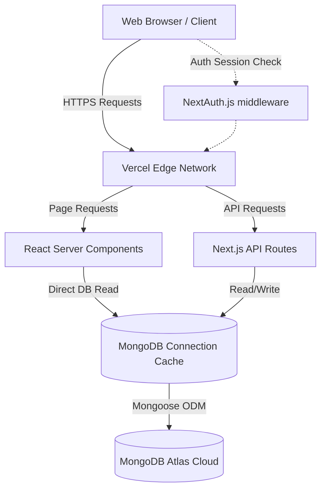
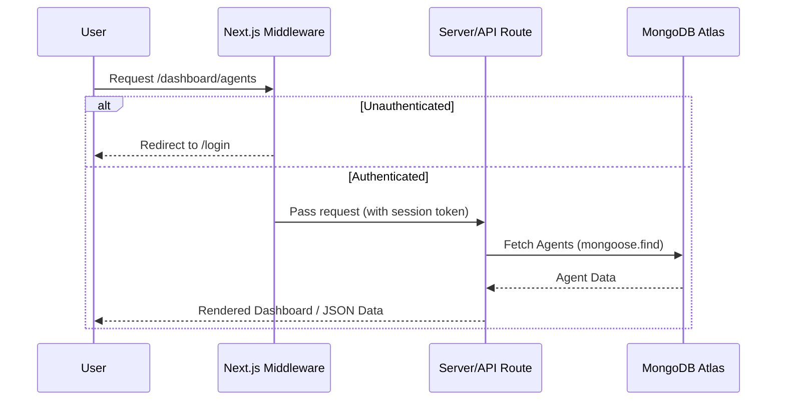
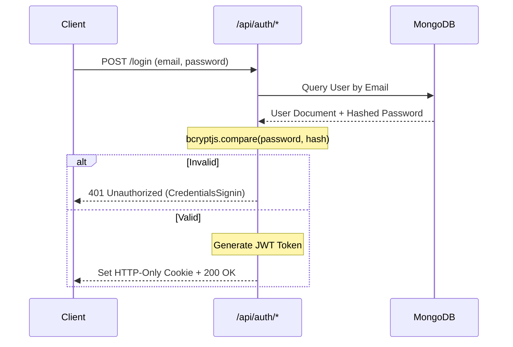

# Architecture Overview

## High-Level Architecture Overview

Aether AI is designed as a modern, full-stack Next.js application utilizing the App Router paradigm. It follows a serverless architecture model tailored for seamless deployment on Edge/Serverless environments (like Vercel). The frontend and backend are unified within the same repository, sharing types, utilities, and configuration, allowing for high developer velocity and a cohesive codebase.

### Core Architecture Pillars:
1. **Frontend**: React-based UI heavily utilizing Server Components (RSC) for initial data fetching and SEO, paired with Client Components for rich interactivity (animations, modals, form handling).
2. **Backend**: Next.js API Route Handlers acting as a stateless RESTful layer.
3. **Database**: MongoDB hosted on MongoDB Atlas, accessed via Mongoose ODM. Connection pooling is strictly managed to prevent exhaustion in serverless environments.
4. **Authentication**: NextAuth.js managing secure JWT sessions, stored in HTTP-only cookies.

---

## System Architecture Diagram



---

## Request Flow Diagram



---

## Authentication Flow Diagram



---

## Authorization Strategy

Authorization is implemented at multiple layers of the application to ensure complete security:

1. **Middleware Level (`middleware.ts`)**: Prevents unauthenticated users from accessing any route prefixed with `/dashboard`. It acts as the first line of defense.
2. **Server-Side Session Validation**: Within API routes (`/api/users`, `/api/agents`), the session is checked via `getServerSession`. If invalid, the API returns `401 Unauthorized`.
3. **Role-Based Access Control (RBAC)**: 
   - The `User` model contains a `role` field (`admin` | `user`).
   - The session token includes the user's role.
   - Specific API routes (like `DELETE /api/users/[id]`) and UI elements (like the Users Sidebar Tab) explicitly check if `session.user.role === 'admin'`. If a standard user attempts to bypass the UI and hit the API directly, the server returns `403 Forbidden`.

---

## Middleware Overview

The application utilizes Next.js middleware to protect private routes efficiently at the edge. The middleware checks for the presence of a valid NextAuth session token. If the token is missing and the user is attempting to access `/dashboard` or its sub-paths, they are intercepted and redirected to `/login` before the request ever hits the Node.js server.

---

## Folder Structure Explanation

```text
├── .github/workflows/   # CI/CD pipeline definitions
├── app/                 # Next.js App Router (Pages & API Routes)
│   ├── api/             # Serverless API Route Handlers
│   ├── dashboard/       # Protected Dashboard Routes
│   ├── login/           # Authentication Routes
│   ├── register/        # Authentication Routes
│   └── page.tsx         # Marketing Homepage
├── components/          # Reusable React Components
│   ├── common/          # Badges, Panels, Skeletons, Wrappers
│   ├── dashboard/       # Dashboard specific components
│   ├── home/            # Marketing section components
│   ├── layout/          # Navbar, Footer, AppShell, Sidebar
│   └── ui/              # shadcn/ui primitive components
├── lib/                 # Utility functions and configurations
│   ├── auth.ts          # NextAuth configuration and logic
│   ├── mongodb.ts       # MongoDB connection caching
│   └── utils.ts         # Tailwind merging utilities
├── models/              # Mongoose Database Schemas
│   ├── Agent.ts         # AI Agent Schema
│   └── User.ts          # User Account Schema
```

**Rationale:** By splitting `components/` into feature-specific directories (`home/`, `dashboard/`, `common/`), the codebase remains highly scannable. The `app/` directory is strictly reserved for routing and data fetching.

---

## API Surface Documentation

### Authentication Routes
- `POST /api/auth/register`: Validates payload via Zod, checks for existing user, hashes password via `bcryptjs`, and saves to MongoDB.
- `POST /api/auth/[...nextauth]`: Handled internally by NextAuth for session creation and JWT management.

### Agent Management
- `GET /api/agents`: Retrieves a paginated, searchable list of agents.
- `POST /api/agents`: Creates a new agent linked to the authenticated user's ID.
- `PUT /api/agents/[id]`: Updates an existing agent.
- `DELETE /api/agents/[id]`: Deletes an agent.

### User Management
- `GET /api/users`: Admin-only. Retrieves a paginated list of users.
- `PUT /api/users/[id]`: Admin-only. Updates user roles or details.
- `DELETE /api/users/[id]`: Admin-only. Deletes a user account.

---

## Database Design

The application uses a NoSQL document database (MongoDB). The design is denormalized where appropriate, but utilizes references (ObjectIds) to maintain relationships between Users and the Agents they create.

### Collection Schemas

#### User Collection (`User.ts`)
| Field       | Type     | Attributes                        |
| ----------- | -------- | --------------------------------- |
| `_id`       | ObjectId | Auto-generated                    |
| `name`      | String   | Required                          |
| `email`     | String   | Required, Unique, Lowercase       |
| `password`  | String   | Select: false (hidden by default) |
| `role`      | String   | Enum: ['admin', 'user']           |
| `createdAt` | Date     | Auto-generated via timestamps     |
| `updatedAt` | Date     | Auto-generated via timestamps     |

#### Agent Collection (`Agent.ts`)
| Field         | Type     | Attributes                                 |
| ------------- | -------- | ------------------------------------------ |
| `_id`         | ObjectId | Auto-generated                             |
| `name`        | String   | Required                                   |
| `description` | String   | Required                                   |
| `status`      | String   | Enum: ['active', 'inactive', 'archived']   |
| `createdBy`   | ObjectId | Required, Ref: 'User'                      |
| `createdAt`   | Date     | Auto-generated via timestamps              |
| `updatedAt`   | Date     | Auto-generated via timestamps              |

### Relationships Between Collections
- **One-to-Many**: A `User` can create many `Agents`. The `Agent` schema maintains a reference to the `User` via the `createdBy` field. 
- When querying agents, we use `.populate('createdBy', 'name email')` to inject the user details into the agent payload without duplicating data.

---

## Validation Strategy

- **Client-Side**: React Hook Form is used to manage form state, preventing unnecessary re-renders. Validation logic is handled seamlessly before network requests are made to ensure a snappy user experience.
- **Server-Side**: Zod is utilized in API Route Handlers to strictly parse and validate incoming JSON payloads. This ensures type safety at the network boundary and protects the database from malformed data.

---

## Error Handling Strategy

1. **API Boundaries**: `try/catch` blocks wrap all database interactions. Zod parsing errors are returned as `400 Bad Request` with specific field issues. Internal errors are logged, and generic `500 Internal Server Error` messages are returned to prevent leaking stack traces.
2. **NextAuth Integration**: Authentication errors specifically `return null` in the `authorize` callback. This is intercepted by NextAuth and returned securely as a `CredentialsSignin` error, which the frontend safely maps to user-friendly messages like "Invalid email or password."
3. **Frontend UI**: Axios/Fetch errors are caught and piped into local state to display inline error messages or toast notifications, ensuring the application never crashes completely.

---

## Security Considerations

- **Password Hashing**: Plaintext passwords are never stored. `bcryptjs` is used to hash passwords with a salt round of 10.
- **XSS Protection**: React intrinsically sanitizes inputs rendered in JSX. 
- **CSRF Protection**: NextAuth automatically generates and validates CSRF tokens for all authentication-related requests.
- **SQL/NoSQL Injection**: Mongoose ODMs implicitly cast and sanitize inputs against their Schema types, preventing arbitrary object injection.
- **Environment Variables**: Secrets are stored in Vercel's encrypted environment variables and never exposed to the browser.

---

## CI/CD Pipeline Architecture

Implemented via GitHub Actions (`ci.yml`):
- **Triggers**: Runs on `push` and `pull_request` to the `main` branch.
- **Environment**: Ubuntu Latest, Node.js v20.
- **Steps**:
  1. `npm ci` ensures a clean, predictable dependency tree.
  2. `npm run lint` enforces ESLint rules.
  3. `npm run type-check` strictly enforces TypeScript integrity.
  4. `npm run build` runs the full Next.js production compiler.
- **Blocker**: If any stage fails, the pipeline fails, preventing broken code from being merged or deployed.

---

## Deployment Architecture

Deployed seamlessly on Vercel:
- **Serverless Functions**: Next.js API Routes are automatically compiled into isolated AWS Lambdas.
- **Edge Network**: Static assets (images, CSS, JS bundles) and pre-rendered Marketing pages are cached heavily on Vercel's global CDN (Edge Network) for millisecond latency.
- **Database Connection Caching**: `lib/mongodb.ts` implements a global caching mechanism to prevent Next.js hot-reloads or serverless cold starts from rapidly exhausting the MongoDB Atlas connection pool.

---

## Performance Considerations

- **Next.js Image Component**: `next/image` is used for automatic WebP conversion, lazy loading, and layout shift prevention.
- **Client/Server Component Split**: The UI isolates heavy interactivity into client boundary (`'use client'`) islands, allowing the majority of the page structure to be server-rendered and shipped with zero JavaScript overhead.
- **Debouncing**: Network requests triggered by user keystrokes (search bars) are debounced to prevent API rate limiting and database thrashing.

---

## Scalability Considerations

- **Database Indexes**: To scale to millions of rows, proper MongoDB compound indexes must be applied to the `email` field in `User` and the `name`/`createdBy` fields in `Agent`.
- **Stateless Auth**: By relying on JWTs rather than database-backed sessions, the authentication layer scales infinitely.

---

## Trade-Offs Made

1. **JWT over Database Sessions**: 
   - *Trade-off*: We cannot instantly revoke a session (e.g., if a user is banned) until the JWT expires.
   - *Benefit*: Reduces database load significantly since every protected route doesn't require a DB lookup.
2. **MongoDB Regular Expression Search**: 
   - *Trade-off*: Using regex (`$regex`) for the search feature is slow on massive datasets.
   - *Benefit*: Extremely fast to implement without requiring a third-party indexing service (like Algolia or ElasticSearch) for the MVP.
3. **Tailwind CSS**: 
   - *Trade-off*: HTML classes become verbose.
   - *Benefit*: Zero runtime CSS evaluation, rapid iteration, and heavily optimized production CSS bundles.

---

## Future Improvements

1. **OAuth Providers**: Integrate Google and GitHub login via NextAuth.
2. **Rate Limiting**: Implement Upstash Redis to apply strict rate limits to the `/api/auth/register` endpoint to prevent bot spam.
3. **Full-Text Search**: Migrate from Regex searching to MongoDB Atlas Search (Lucene) for typo-tolerance and performance.
4. **Automated Testing**: Integrate Jest for unit testing API routes and Playwright for End-to-End (E2E) testing the user flows in the CI pipeline.
